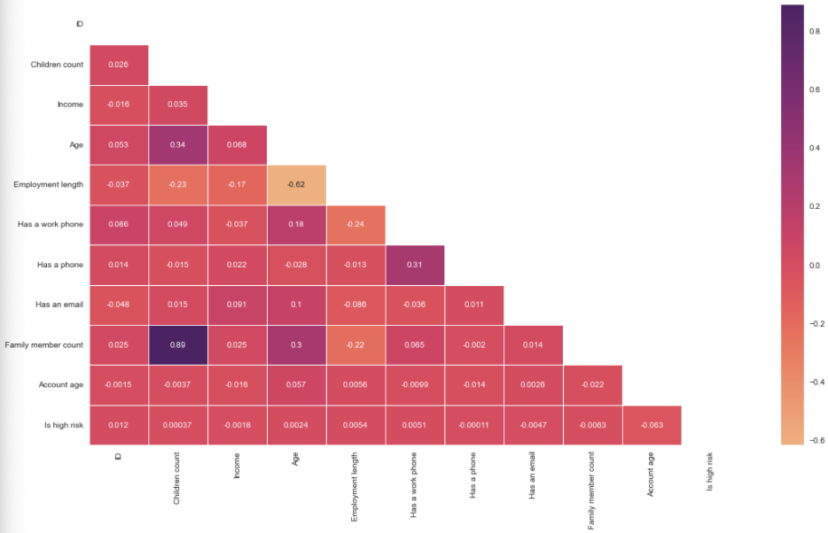

# Key findings: People with the highest income, and who have at least one partner, are more likely to be approved for a credit card.

## Table of Contents

  - [Business problem](#business-problem)
  - [Data source](#data-source)
  - [Quick glance at the results](#quick-glance-at-the-results)
  - [Lessons learned and recommendation](#lessons-learned-and-recommendation)

## Business problem

This app predicts if an applicant will be approved for a credit card or not. Each time there is a hard enquiry your credit score is affected negatively. This app predict the probability of being approved without affecting your credit score. This app can be used by applicant who wants to find out if they will be approved for a credit card without affecting their credit score.
## Data source

- [Kaggle credit card approval prediction](https://www.kaggle.com/rikdifos/credit-card-approval-prediction)

## Quick glance at the results

Correlation between the features.

Confusion matrix of gradient boosting classifier.

ROC curve of gradient boosting classifier.

Top 3 models (with default parameters)

| Model     	                | Recall score 	|
|-------------------	        |------------------	|
| Support vector machine     	| 88% 	            |
| Gradient boosting    	        | 90% 	            |
| Adaboost               	    | 79% 	            |

- **The final model used for this project: Gradient boosting**
- **Metrics used: Recall**
- **Why choose recall as metrics**:
  Since the objective of this problem is to minimize the risk of a credit default, the metrics to use depends on the current economic situation:

  - During a bull market (when the economy is expanding), people feel wealthy and are employed. Money is usually cheap, and the risk of default is low because of economic stability and low unemployment. The financial institution can handle the risk of default; therefore, it is not very strict about giving credit. The financial institution can handle some bad clients as long as most credit card owners are good clients (aka those who pay back their credit in time and in total).In this case, having a good recall (sensitivity) is ideal.

  - During a bear market (when the economy is contracting), people lose their jobs and money through the stock market and other investment venues. Many people struggle to meet their financial obligations. The financial institution, therefore, tends to be more conservative in giving out credit or loans. The financial institution can't afford to give out credit to many clients who won't be able to pay back their credit. The financial institution would rather have a smaller number of good clients, even if it means that some good clients are denied credit. In this case, having a good precision (specificity) is desirable.

    ***Note***: There is always a trade-off between precision and recall. Choosing the right metrics depends on the problem you are solving.

    ***Conclusion***: Since the time I worked on this project (beginning 2022), we were in the longest bull market (excluding March 2020 flash crash) ever recorded; we will use recall as our metric.

 **Lessons learned and recommendation**

- Based on this project's analysis, income, family member headcount, and employment length are the three most predictive features in determining whether an applicant will be approved for a credit card. Other features like age and working employment status are also helpful. The least useful features are the type of dwelling and car ownership.
- The recommendation would be to focus more on the most predictive features when looking at the applicant profile and pay less attention to the least predictive features.

## Limitation and what can be improved

- Combine this model with with a regression model to predict how much of a credit limit an applicant will be approved for.
- Hyperparameter tuning with grid search or random search.
- Better interpretation of the chi-square test
- Retrain the model without the least predictive features

